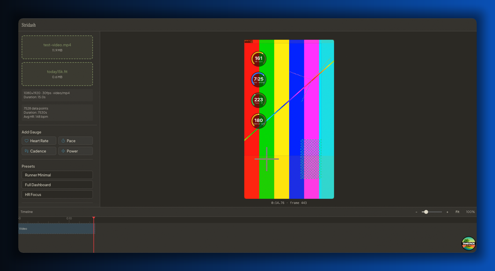

## **Stridash**

**Stridash** is a synchronization tool designed to overlay real-time athletic performance data onto video footage. By matching the timestamps of a video file with the telemetry from a `.fit` file, Stridash creates a data-rich visual representation of your activity.

---

### **Core Functionality**

The app resolves the challenge of manually aligning video clips with sports watch data:

- **Simultaneous Recording:** Record video while your sports watch tracks your activity (e.g., running, cycling).

- **Data Integration:** Import your video file and the corresponding `.fit` file exported from your wearable device.

- **Temporal Sync:** The app automatically aligns the video’s specific timeframe (e.g., a 15-second clip at 6:00:15 AM) with the exact data points from your total activity duration.

- **Dynamic Overlay:** Generates a result showing your activity metrics (speed, heart rate, elevation) as a synchronized overlay on your video.

### **How it Works**

1. **Record:** Start your activity tracking on your watch and capture video at any point during that session.

2. **Download:** Export the `.fit` file from your activity provider (Garmin, Strava, etc.).

3. **Sync:** Upload both files to Stridash. The app parses the timestamps to find the precise match.

4. **Result:** View or export your video with a professional data overlay that mirrors your condition at the exact moment the footage was taken.

### **Tech Stack**

This project leverages my experience in building maintainable, high-quality web applications:

- **Frontend:** React (TypeScript).

- **Logic:** Precise temporal data matching and file parsing.
